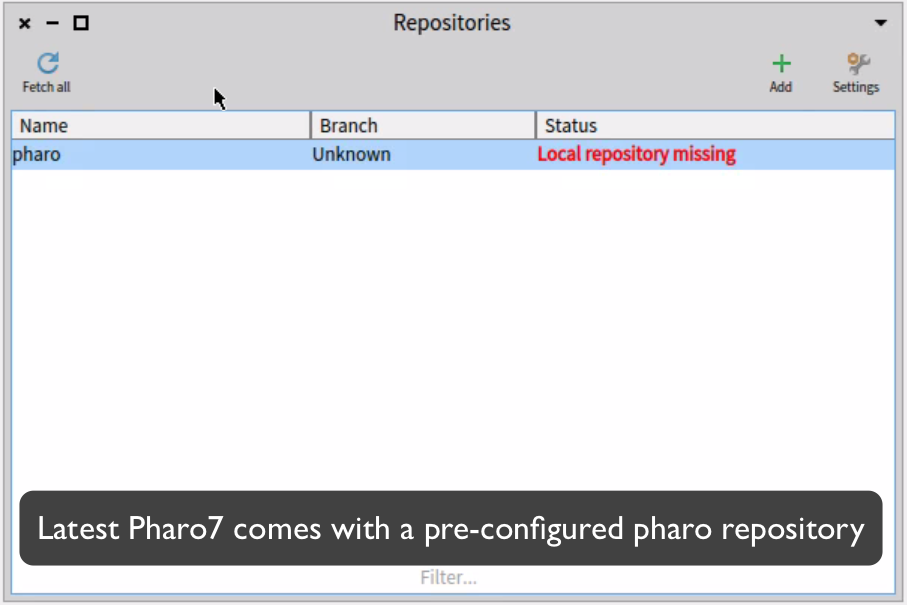
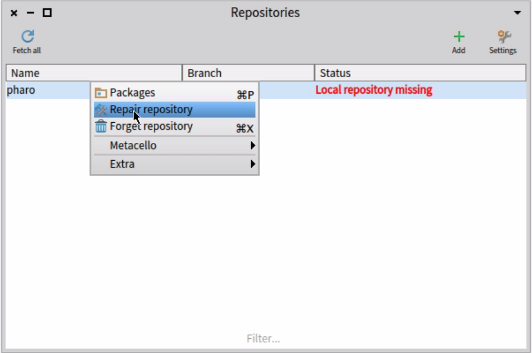
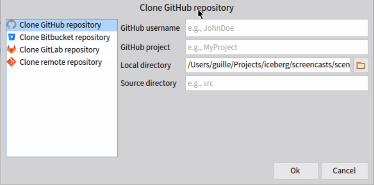
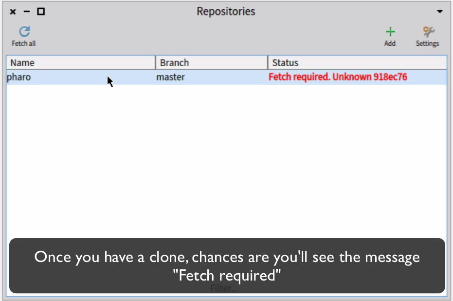
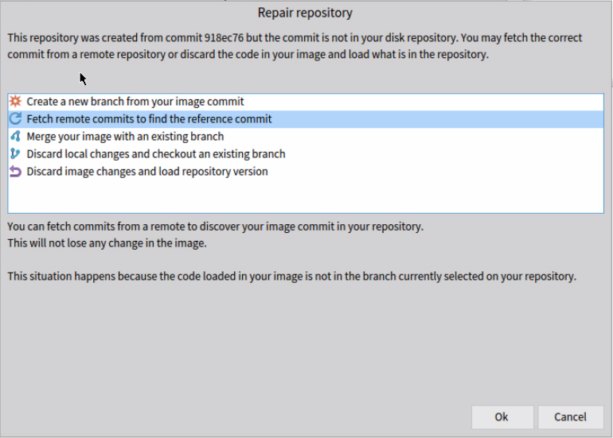
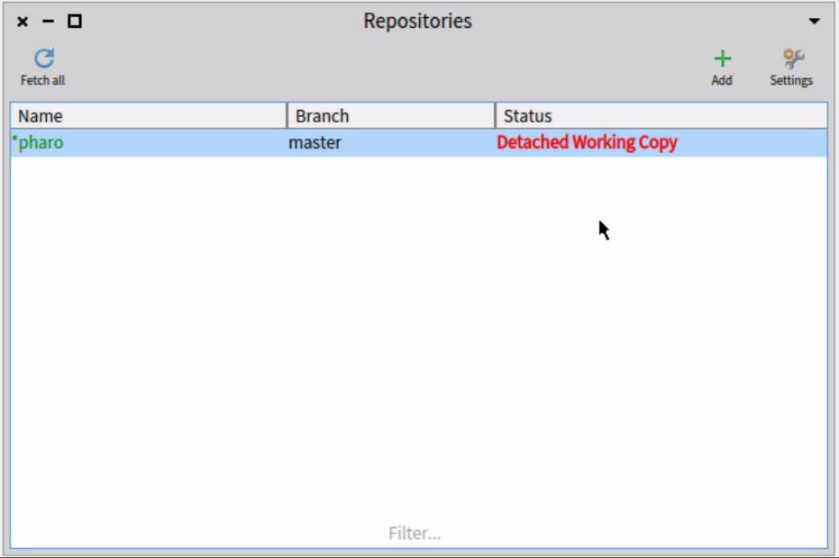
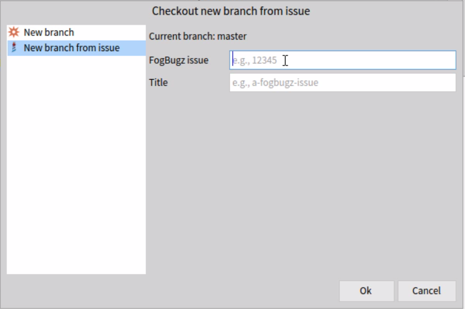

> Note: This textual tutorial is also available as a video in [youtube](https://www.youtube.com/watch?v=PK2yCu2rWCc&feature=youtu.be).

Pharo7 image with Iceberg 0.7.3 comes with a pre-configured Pharo repository.
This repository will most be in state "Local Repository Missing". This means that the image does not find a pharo clone in your disk. You can have more details of it in the [Glossary](Iceberg-glossary).

## Repairing local repository missing

To solve this situation, you need to rebind your repository with a clone in disk.
You will be proposed with the repair menu item/button.

And clicking on it will show you the repair view, showing an explanation of the current situation and some proposed solutions:

You can then choose to search in your disk for an existing clone or to clone a new repository.

Once the repository has a clone, it will check the repository status and most probably you'll find out that your repository is in **Fetch required** state.

## Solving the Fetch Required

**Fetch Required** means that your image was built from a commit that cannot be found in your repository.
In other words, we need to update your repository, doing a fetch (more details of it in the [Glossary](Iceberg-glossary)).

If you click again on the repair action, you'll see that there are other repair actions available.
Usually, if you already have all your remotes correctly configured, doing a fetch will put you in a **Detached Working Copy ** state. 

## Solving the Detached Working Copy

**Detached Working Copy** means that the image commit does not correspond with the repository commit (more details of it in the [Glossary](Iceberg-glossary)). At this point, we need to synchronize both to be able to work.

Most of the times, the easier thing to do in this case is to just create a new branch.
If you already know which issue you'll be working on, you can create a branch using the "New branch from issue" option.
Otherwise, a nice alternative is to create a temporary branch like **temp/synch** that you can later on remove.

## You're ready to work

Once you synchronized your repository, you can
- make changes in your image,
- commit in your branch,
- push your branch to your fork
- make a pull request